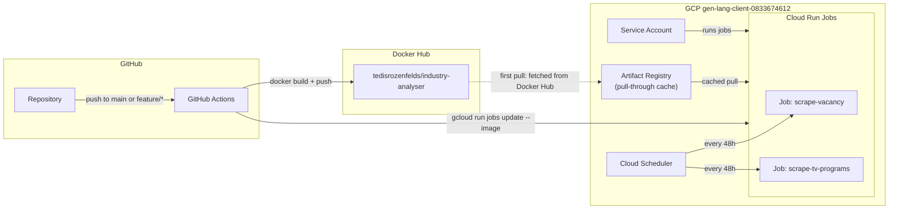

# GCP Cloud Run Scheduled Scraping Jobs -- Deployment Plan

## Current State

- **Project:** Python/Django app at `https://github.com/Ted-Rose/industry-analyser.git`
- **Docker Hub:** `https://hub.docker.com/r/tedisrozenfelds/industry-analyser`
- **Tasks to deploy:**
  - `python manage.py scrape_first_vacancy_portal` (vacancy scraper hitting cv.lv)
  - `python manage.py scrape_tv_programs` (TV program scraper hitting tet.lv + IMDb)
- **Repo now includes:** Dockerfile, `terraform/`, and `.github/workflows/deploy-scraper-jobs.yml` (see below)
- **GCP project:** `gen-lang-client-0833674612` ([Console](https://console.cloud.google.com/welcome?project=gen-lang-client-0833674612))
- **Database:** Postgres via `DATABASE_URL` env var (with optional TLS cert via `DB_SSL_CERT`)
- **Env vars needed at runtime:** `SECRET_KEY`, `DEBUG`, `BASE_URL`, `DATABASE_URL`, optionally `DB_SSL_CERT`

---

## Architecture



---

## Secrets & Configuration

Use your real values from a secure `.env` or secret manager. **Do not commit secrets to git.**

| Secret / input | Description | Where used |
|----------------|-------------|------------|
| `DOCKERHUB_USERNAME` | Docker Hub user | GitHub Actions — `docker login` |
| `DOCKERHUB_TOKEN` | Docker Hub access token (PAT) | GitHub Actions |
| `GCP_PROJECT_ID` | e.g. `gen-lang-client-0833674612` | GitHub Actions + Terraform |
| `GCP_SA_KEY` | JSON key for a CI deployer service account (see bootstrap) | GitHub Actions — `google-github-actions/auth` |
| Terraform `secret_key`, `database_url`, `base_url`, `db_ssl_cert`, … | Same semantics as Django env vars | `terraform apply` → Cloud Run Job template env |

Runtime job env (`SECRET_KEY`, `DATABASE_URL`, `BASE_URL`, `DB_SSL_CERT`, optional `HARD_CODED_PASSWORD`, `GEMINI_API_KEY`) is set on the Cloud Run Job definitions via **`terraform/terraform.tfvars`** (gitignored). Copy from `terraform/terraform.tfvars.example`.

## What the agent creates (all GCP resources)

The agent autonomously provisions everything on GCP. Nothing needs to be created manually.

### GCP APIs (enabled by agent)

```bash
gcloud services enable \
  run.googleapis.com \
  cloudscheduler.googleapis.com \
  cloudresourcemanager.googleapis.com \
  artifactregistry.googleapis.com \
  iam.googleapis.com \
  --project=gen-lang-client-0833674612
```

### GCP resources (created by agent via Terraform)

- Service accounts: Terraform creates **runtime** and **scheduler invoker** accounts; bootstrap creates a separate **deployer** account whose key is stored as GitHub secret `GCP_SA_KEY`
- Artifact Registry remote repository (Docker Hub pull-through cache)
- Cloud Run Job: `scrape-vacancy`
- Cloud Run Job: `scrape-tv-programs`
- Cloud Scheduler: `trigger-scrape-vacancy`
- Cloud Scheduler: `trigger-scrape-tv-programs`
- IAM bindings (invoker role for scheduler, runner role for SA)

---

## Why Docker Hub + Artifact Registry pull-through cache

CI/CD pushes images to **Docker Hub** (simple, no GCP auth needed for pushes).
Cloud Run pulls images through an **Artifact Registry remote repository** that acts as a transparent cache in front of Docker Hub.

Benefits:
- **No Docker Hub rate limits** -- anonymous pulls from shared GCP IPs hit Docker Hub's 100 pulls/6h cap quickly; the AR cache eliminates repeated pulls.
- **Lower latency** -- cached layers are served from the same GCP region (`europe-north1`) instead of crossing the Atlantic to Docker Hub.
- **Resilience** -- if Docker Hub has an outage, cached images still work.
- **Zero workflow changes** -- you still `docker push` to Docker Hub; AR fetches and caches automatically on first pull.

---

## Step-by-step Implementation

### 1. Create Dockerfile

Create `Dockerfile` at repo root. No `CMD` -- Cloud Run Jobs override the command per job.

```dockerfile
FROM python:3.12-slim

WORKDIR /app

RUN apt-get update && apt-get install -y --no-install-recommends \
    libpq-dev gcc && \
    rm -rf /var/lib/apt/lists/*

COPY requirements.txt .
RUN pip install --no-cache-dir -r requirements.txt

COPY . .

ENV PYTHONUNBUFFERED=1
ENV PYTHONPATH=/app
ENV DJANGO_SETTINGS_MODULE=industry_analyser.settings
```

Create `.dockerignore`:

```
venv/
.vscode/
.git/
*.pyc
__pycache__/
logs/
db.sqlite3
.env
staticfiles/
```

---

### 2. Create Terraform configuration

New directory: `terraform/`

#### `terraform/variables.tf`

Input variables for project ID, region, Docker image tag, and runtime env vars.

#### `terraform/main.tf`

Provisions:

- **Google provider** configuration for project `gen-lang-client-0833674612`
- **Artifact Registry remote repository** (pull-through proxy for Docker Hub)
  - Mode: `REMOTE_REPOSITORY`, upstream: Docker Hub
  - Cloud Run Jobs reference images via the AR proxy URL
  - First pull fetches from Docker Hub and caches; subsequent pulls served from AR cache
  - Avoids Docker Hub rate limits, reduces latency, survives Docker Hub outages
- **Service Account** for Cloud Run Jobs (least-privilege: only run jobs)
- **Cloud Run Job: `scrape-vacancy`**
  - Image: `europe-north1-docker.pkg.dev/gen-lang-client-0833674612/dockerhub-cache/tedisrozenfelds/industry-analyser:latest`
  - Container command: `["python", "manage.py", "scrape_first_vacancy_portal"]`
  - Timeout: `10800s` (3 hours)
  - Task count: 1, max retries: 0
  - Env vars: `SECRET_KEY`, `DATABASE_URL`, `BASE_URL`, `DB_SSL_CERT`, `DEBUG=False`
- **Cloud Run Job: `scrape-tv-programs`**
  - Image: `europe-north1-docker.pkg.dev/gen-lang-client-0833674612/dockerhub-cache/tedisrozenfelds/industry-analyser:latest`
  - Container command: `["python", "manage.py", "scrape_tv_programs"]`
  - Timeout: `10800s` (3 hours)
  - Same env config as above
- **Cloud Scheduler: `trigger-scrape-vacancy`**
  - Cron: `0 2 */2 * *` (every second day at 02:00 UTC)
  - Target: HTTP POST to Cloud Run Job execution API
  - Auth: service account with `roles/run.invoker`
- **Cloud Scheduler: `trigger-scrape-tv-programs`**
  - Cron: `0 3 */2 * *` (every second day at 03:00 UTC, offset 1h to avoid overlap)

Example Cloud Run Job resource:

```hcl
resource "google_artifact_registry_repository" "dockerhub_cache" {
  location      = var.region
  repository_id = "dockerhub-cache"
  format        = "DOCKER"
  mode          = "REMOTE_REPOSITORY"

  remote_repository_config {
    docker_repository {
      public_repository = "DOCKER_HUB"
    }
  }
}

resource "google_cloud_run_v2_job" "scrape_vacancy" {
  name     = "scrape-vacancy"
  location = var.region

  template {
    template {
      timeout = "10800s"
      containers {
        image   = "${var.region}-docker.pkg.dev/${var.project_id}/dockerhub-cache/tedisrozenfelds/industry-analyser:${var.image_tag}"
        command = ["python", "manage.py", "scrape_first_vacancy_portal"]
        resources {
          limits = { memory = "512Mi", cpu = "1" }
        }
        dynamic "env" {
          for_each = var.env_vars
          content {
            name  = env.key
            value = env.value
          }
        }
      }
      max_retries     = 0
      service_account = google_service_account.cloud_run_sa.email
    }
    task_count = 1
  }
}
```

#### `terraform/outputs.tf`

Outputs: job names, scheduler names, service account email.

---

### 3. Create GitHub Actions CI/CD pipeline

New file: `.github/workflows/deploy-scraper-jobs.yml`

**Trigger:** push to `main` branch (path filter: only when app code, Dockerfile, or requirements change)

**Jobs:**

#### Job 1: `build-and-push`
1. Checkout code
2. Log in to Docker Hub via `docker/login-action@v3` using `DOCKERHUB_USERNAME` + `DOCKERHUB_TOKEN`
3. Build image: `docker build -t tedisrozenfelds/industry-analyser:${{ github.sha }} .`
4. Tag as latest: `docker tag ... tedisrozenfelds/industry-analyser:latest`
5. Push both tags

#### Job 2: `deploy` (depends on `build-and-push`)
1. Authenticate to GCP via `google-github-actions/auth@v2` using `GCP_SA_KEY`
2. Set up gcloud via `google-github-actions/setup-gcloud@v2`
3. Update both Cloud Run Jobs to the new image (via Artifact Registry proxy URL):
   ```bash
   IMAGE="europe-north1-docker.pkg.dev/gen-lang-client-0833674612/dockerhub-cache/tedisrozenfelds/industry-analyser:$SHA"

   gcloud run jobs update scrape-vacancy \
     --image=$IMAGE --region=europe-north1

   gcloud run jobs update scrape-tv-programs \
     --image=$IMAGE --region=europe-north1
   ```
   Cloud Run pulls through the AR cache; AR transparently fetches from Docker Hub on first access and caches for subsequent pulls.

---

### 4. Bootstrap sequence (all done autonomously by AI agent)

The agent executes everything in this order. No manual steps required.

1. **Enable GCP APIs:**
   ```bash
   gcloud services enable run.googleapis.com cloudscheduler.googleapis.com \
     cloudresourcemanager.googleapis.com artifactregistry.googleapis.com \
     iam.googleapis.com \
     --project=gen-lang-client-0833674612
   ```

2. **Create GCP Service Account + export key:**
   ```bash
   gcloud iam service-accounts create industry-analyser-deployer \
     --display-name="Industry Analyser CI/CD" \
     --project=gen-lang-client-0833674612

   # Grant required roles
   for role in roles/run.admin roles/cloudscheduler.admin roles/iam.serviceAccountUser roles/artifactregistry.admin; do
     gcloud projects add-iam-policy-binding gen-lang-client-0833674612 \
       --member="serviceAccount:industry-analyser-deployer@gen-lang-client-0833674612.iam.gserviceaccount.com" \
       --role="$role"
   done

   # Export key JSON
   gcloud iam service-accounts keys create gcp-sa-key.json \
     --iam-account=industry-analyser-deployer@gen-lang-client-0833674612.iam.gserviceaccount.com
   ```

3. **Set GitHub Actions secrets** (values from your environment, not from this repo):
   ```bash
   gh secret set DOCKERHUB_USERNAME --body "<your-dockerhub-user>"
   gh secret set DOCKERHUB_TOKEN --body "<your-dockerhub-token>"
   gh secret set GCP_SA_KEY < gcp-sa-key.json
   gh secret set GCP_PROJECT_ID --body "gen-lang-client-0833674612"
   ```
   Django runtime secrets belong in **`terraform/terraform.tfvars`** for `terraform apply`, not in GitHub (unless you later extend the workflow to sync them).

4. **Terraform init + apply** in `terraform/` directory -- creates Artifact Registry remote repo (Docker Hub pull-through cache), Cloud Run Jobs with all env vars, Cloud Scheduler triggers, and IAM bindings.

5. **Build and push the first Docker image:**
   ```bash
   docker build -t tedisrozenfelds/industry-analyser:latest .
   docker push tedisrozenfelds/industry-analyser:latest
   ```

6. **Verify jobs** by executing them once:
   ```bash
   gcloud run jobs execute scrape-vacancy --region=europe-north1 --project=gen-lang-client-0833674612
   gcloud run jobs execute scrape-tv-programs --region=europe-north1 --project=gen-lang-client-0833674612
   ```

7. **Clean up** local key file:
   ```bash
   rm gcp-sa-key.json
   ```

---

### 5. Region choice

**Cloud Run Jobs and Artifact Registry:** `europe-north1` (Finland) — closest to the scraping targets (Latvia).

**Cloud Scheduler:** must use a [supported Scheduler location](https://cloud.google.com/scheduler/docs/locations); `europe-north1` is **not** valid for Cloud Scheduler. Terraform defaults `scheduler_region` to `europe-west1` while jobs stay in `europe-north1`.

**Terraform default container image:** Jobs are created with `us-docker.pkg.dev/cloudrun/container/job:latest` so the first `terraform apply` succeeds before your image exists on Docker Hub or in the Artifact Registry cache. The GitHub Action then sets both jobs to your real image (`.../dockerhub-cache/...:${GITHUB_SHA}`).

### 5b. GitHub Actions secrets required

Set `DOCKERHUB_USERNAME` and `DOCKERHUB_TOKEN` in the repo (Settings → Secrets). `GCP_SA_KEY` and `GCP_PROJECT_ID` can be provisioned as in the bootstrap section.

---

### 6. Files to create (summary)

| File | Purpose |
|------|---------|
| `Dockerfile` | Container image for the Django app |
| `.dockerignore` | Exclude unnecessary files from image |
| `terraform/main.tf` | AR remote repo (Docker Hub cache), Cloud Run Jobs, Scheduler, SA |
| `terraform/variables.tf` | Input variables |
| `terraform/versions.tf` | Provider + backend (local state by default) |
| `terraform/outputs.tf` | Output values |
| `terraform/terraform.tfvars.example` | Example for `terraform.tfvars` (gitignored) |
| `terraform/.terraform.lock.hcl` | Provider lock file |
| `.github/workflows/deploy-scraper-jobs.yml` | CI/CD: build, push to Docker Hub, update Cloud Run Jobs |

---

### 7. Cost estimate

- **Cloud Run Jobs:** billed only while running. Two jobs every 2 days, each up to 3h with 512Mi/1vCPU -- well within free tier for light usage.
- **Cloud Scheduler:** 3 free jobs per account; these 2 fit within free tier.
- **Docker Hub:** free tier allows unlimited public repos. Pulls go through AR cache so Docker Hub rate limits are not a concern.
- **Artifact Registry (remote repo):** storage-based; cached layers for one image ~ cents/month.

---

### 8. Auto-kill after 3 hours

Cloud Run Jobs natively enforce the `timeout` field. When set to `10800s` (3 hours), GCP will forcefully terminate the container if the job has not completed. No additional kill logic is needed.
